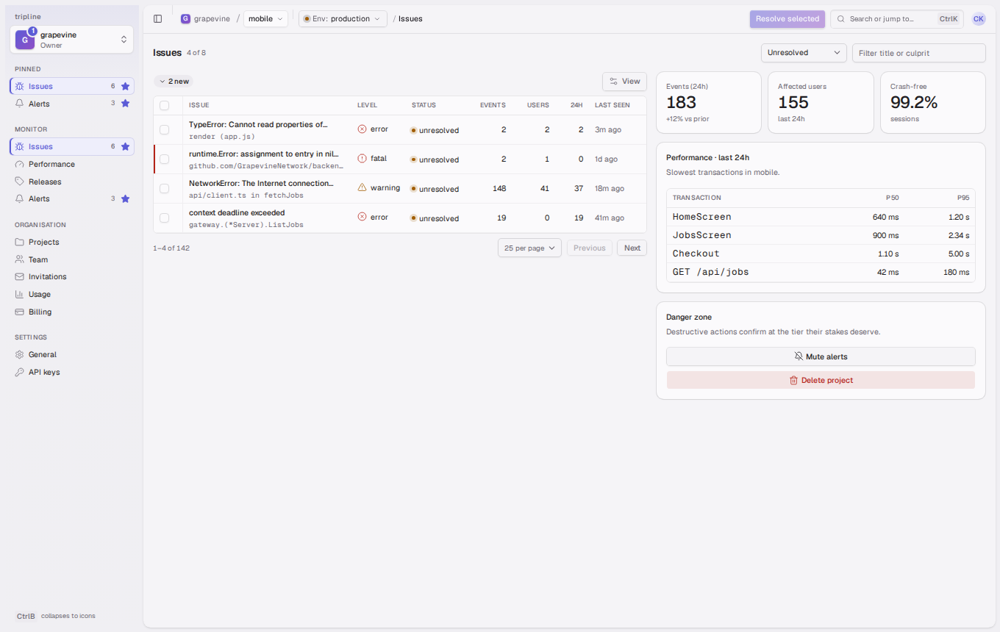

# @latchkey/shell

One theme and one app shell for the consoles that sign in through latchkey:
**tripline** (errors and performance), **runsheet** (runbooks and ops), the
**latchkey console** (identity admin), **wardroom** (the team hub), **purser**
(support and the customer record) and **foghorn** (outbound marketing). Each
app differs only in its accent colour and the nav groups it passes in.

React 19 · TypeScript · Tailwind v4 · shadcn/ui (radix) · lucide · cmdk ·
sonner · TanStack Table v9. Shipped as TypeScript source; the consumer's Vite
build compiles it.



The design contract is [`docs/DESIGN.md`](docs/DESIGN.md); the research
behind it is in `docs/research/`.

## Install

The package is consumed as a git dependency:

```json
{
  "dependencies": {
    "@latchkey/shell": "github:latchkeyid/shell"
  }
}
```

Requirements on the consumer:

- `react` and `react-dom` ^19 (peer dependencies).
- Vite with `@vitejs/plugin-react` and `@tailwindcss/vite`.
- `tsconfig.json` with `"moduleResolution": "bundler"` and `"jsx": "react-jsx"`.

Then in the app's stylesheet, import Tailwind, the base theme, the app's
accent file, and tell Tailwind to scan the shell's source for classes:

```css
@import "tailwindcss";
@import "@latchkey/shell/theme/base.css";
@import "@latchkey/shell/theme/tripline.css"; /* or runsheet / latchkey / wardroom / purser / foghorn .css */
@source "../node_modules/@latchkey/shell/src";
```

`base.css` brings `tw-animate-css` and the self-hosted Geist fonts with it.
The accent file only sets `--primary`, `--accent-2`, `--accent-soft` and the
sidebar mappings; the accent defaults in `base.css` live in a cascade layer,
so the accent file wins whatever the import order.

Fonts: Geist Sans and Geist Mono are vendored as variable woff2 files in
`src/theme/fonts/` (SIL Open Font License) because the `geist` npm package
only exports Next.js font loaders. `npm run fonts` re-copies them from the
package.

## Mounting the shell

```tsx
import { useLocation, useNavigate } from "react-router"
import { AppShell, PageActionBar, PageTitle, type ShellSession } from "@latchkey/shell"
import { Link } from "./link" // the adapter below

export function Layout({ session, children }: { session: ShellSession; children: React.ReactNode }) {
  const navigate = useNavigate()
  const location = useLocation()
  return (
    <AppShell
      app={{ id: "tripline", name: "tripline" }}
      session={session}
      nav={nav}
      scope={scope}
      environment={environment}
      registry={registry}
      LinkComponent={Link}
      currentPath={location.pathname + location.search}
      onNavigate={(href) => navigate(href)}
      callbacks={{
        onSwitch: async (slug) => { await switchOrg(slug) },
        onExitStaffView: () => exitStaffView(),
        onCreateOrg: () => navigate("/orgs/new"),
        onSignOut: () => signOut(),
        searchOrgs: (q, signal) => api.platform.searchOrgs(q, { signal }),
      }}
      seedPins={["issues", "alerts"]}
      defaultTheme="system"
    >
      {children}
    </AppShell>
  )
}
```

Every page renders the action bar as its first child, then its content:

```tsx
<PageActionBar breadcrumbs={[{ label: "Issues" }]} tabs={<Tabs …/>} actions={<Button size="sm">Resolve selected</Button>} />
<main className="flex flex-col gap-4 p-4">
  <PageTitle>Issues</PageTitle>
  …
</main>
```

The shell is router-agnostic. Every link renders through the `LinkComponent`
you pass and every programmatic navigation goes through `onNavigate(href)`.
Without a `LinkComponent` the shell renders plain anchors that call
`onNavigate` on click.

`LinkComponent` receives `href` plus ordinary anchor props. react-router and
TanStack Router both spell the destination `to`, so wrap their `Link` once:

```tsx
import { forwardRef } from "react"
import { Link as RouterLink } from "react-router"
import type { LinkProps } from "@latchkey/shell"

export const Link = forwardRef<HTMLAnchorElement, LinkProps>(function Link({ href, ...props }, ref) {
  return <RouterLink ref={ref} to={href} {...props} />
})
```

`AppShell` wraps its own `ThemeProvider` when none is mounted above it. Mount
`ThemeProvider` yourself when pages outside the shell (the `/welcome` page,
sign-in) need the theme too. tripline and runsheet default to `system`,
latchkey to `light`; the user's explicit choice is persisted in
`localStorage` under `shell.theme`.

## Session model

```ts
type ShellSession = {
  user: { id: string; email: string; name?: string; avatarUrl?: string }
  orgs: Array<{ slug: string; name: string; role: "owner" | "admin" | "member" | "viewer"; avatarUrl?: string; suspended?: boolean }>
  currentOrg?: string
  invitations: Array<{ id: string; orgSlug: string; orgName: string; invitedBy: string; role: string }>
  canCreateOrg: boolean
  staff: boolean                       // platform staff: sees the Platform group
  actAs?: { org: string; reason?: string; expiresAt?: string }
  recentOrgs?: string[]
}
```

Callbacks the shell calls (`ShellCallbacks`):

| Callback | When |
| --- | --- |
| `onSwitch(slug)` | The user picked another org. Rewrite the path in place for org-scoped routes, land on the org home otherwise, clear per-org caches. The shell shows a spinner until the promise resolves, then announces "Switched to …" and moves focus to the page `h1`. |
| `onExitStaffView()` | "Exit staff view" from the banner or the switcher. |
| `onCreateOrg()` | "Create organisation". Defaults to navigating to `/orgs/new`. |
| `onSignOut()` | Account menu. |
| `onTheme(mode)` | The user changed the theme in the account menu. |
| `searchOrgs(q, signal)` | Staff only: platform directory search for non-member orgs, debounced 250ms, aborted when stale. |

Zero orgs: render `WelcomePage` instead of the shell. A URL for an org the
user is not in: render `NotAMemberPage` inside the shell so the switcher
stays mounted (staff get a "View as staff" action).

Staff view-as (`session.actAs`) paints `data-staff-view` on `<html>`, an
amber ring on the switcher trigger, a 2px amber inset on the content frame, a
28px amber banner above the action bar and a `[Staff] ` prefix on
`document.title`. The elevation flow itself belongs to the app.

## Adopting the auth client

`@latchkey/shell` ships the OIDC token client every console should use
instead of handling tokens by hand. It exists because the hand-written ones
all fail the same way: they treat the **access** token's one-hour `exp` as the
boundary of being signed in, and log a person out while a perfectly good
refresh token sits in `localStorage` beside it. See ADR 001 "Stay signed in"
in the `latchkey` repo for the decision behind this section.

### Initialize it

The client owns the **refresh** leg: rotating the refresh token, on a
schedule, once per browser no matter how many tabs are open. Point it at the
issuer's token endpoint and give it the app's `client_id`:

```ts
import { AuthClient, createTokenEndpointCall } from "@latchkey/shell"

const ISSUER = "https://auth.latchkey.id"

export const auth = new AuthClient({
  exchange: createTokenEndpointCall({
    tokenEndpoint: `${ISSUER}/oauth/token`,
    clientId: "runsheet-console",
  }),
})

auth.start()   // adopt what is in storage, arm the schedule, listen for siblings
```

`start()` is idempotent; call it once, as the app boots. Options worth knowing:
`storageKey` (default `latchkey.tokens`) when two apps share an origin,
`refreshAt` (default `0.8` of the access token's life), `channel` / `channelName`
for cross-tab coordination, and `maxAttempts` / `baseBackoffMs` / `maxBackoffMs`
for the retry. Pass `win: null, doc: null, channel: null` to run it inert, as
the tests do.

The **sign-in** leg stays in the app, because the redirect is the app's: it
owns `redirect_uri`, PKCE, `state`, and the callback route that exchanges the
code. When the callback has its tokens, hand them over once —

```ts
auth.adopt({ access_token, refresh_token, expires_at })
```

— and the client takes it from there: it persists them, arms the refresh, and
tells the other tabs.

### "Signed in" is the client's state, never an `exp` check

```ts
auth.isSignedIn()          // holding a live session
auth.snapshot()            // the token set, or null
auth.subscribe((tokens) => setSignedIn(tokens !== null))
```

Do **not** decode the access token and compare `exp` to the clock. An access
token is a one-hour artefact of a session that lasts thirty days; its expiry
is an event the client handles, not a fact the app reads. `isSignedIn()` stays
true while an access token is expired and being rotated, and goes false only
when the issuer actually refuses the refresh token (`invalid_grant`) or the
app signs out. A network error, a captive portal and a 5xx are **not**
sign-outs: the client retries those with backoff and keeps the session.

To send a request by hand, ask for a token rather than reading one — it
rotates first if the held one is stale, and concurrent callers share the one
rotation:

```ts
const token = await auth.getAccessToken()   // string, or null when signed out
```

### Wire the 401 hook into the API layer

With the scheduled refresh doing its job a 401 should be rare. Rare is not
never, so wrap the app's fetch once, at the bottom of its API layer:

```ts
import { withAuthRetry } from "@latchkey/shell"

export const apiFetch = withAuthRetry(fetch, auth)

const response = await apiFetch("/api/runbooks")
```

`withAuthRetry` sets `Authorization: Bearer …` from the client on every
request, and on a 401 refreshes **once** and retries **once** — never in a
loop. A second 401 is returned as the answer. If the refresh cannot rotate,
the original 401 comes back untouched and whether the session ended is
reported through `subscribe`, not through the response. The refresh is the
client's single-flight one, so twenty requests failing together cost one call
to the token endpoint.

Options: `statuses` (default `[401]`; 403 is deliberately excluded — rotating
a token does not change a permissions answer), `header` and `scheme`, and
`authorize: false` when the app attaches credentials itself. The request is
replayed from the `input` and `init` it was given, so a body that can only be
read once — a `ReadableStream`, a consumed `Request` — cannot be retried;
strings, `FormData`, `URLSearchParams` and buffers all can.

### Concurrent tabs coordinate on their own

Nothing to configure. Each client broadcasts its rotations over a
`BroadcastChannel`, falling back to a `localStorage` key other tabs get a
`storage` event for where `BroadcastChannel` is unavailable. A tab that hears
a rotation **adopts** the token and re-arms its own schedule from it; it does
not call the token endpoint. So five open tabs rotate once and all five end up
holding the same token, instead of five rotations racing each other into the
issuer's reuse grace window. A sign-out or an `invalid_grant` in one tab
clears the session in all of them.

A message carries only what a same-origin tab already has in its own
`localStorage`, and is tagged and re-validated on arrival, so an unrelated
channel name or a malformed payload is dropped rather than adopted. Pass
`channel: null` to opt a client out entirely.

### `prompt=none`: the last silent recovery, as a top-level redirect

When the client reports the session ended — cleared storage, a new browser
profile, a revoked token — the person may **still** hold a live session on the
issuer itself. Before showing a sign-in screen, an app may spend one
navigation finding out:

```ts
auth.subscribe((tokens) => {
  if (tokens !== null) return
  const url = new URL(`${ISSUER}/oauth/authorize`)
  url.searchParams.set("prompt", "none")
  url.searchParams.set("client_id", "runsheet-console")
  url.searchParams.set("redirect_uri", `${origin}/auth/callback`)
  url.searchParams.set("response_type", "code")
  url.searchParams.set("state", encodeWhereTheyWere(location))
  window.location.assign(url)          // top-level. See below.
})
```

A live issuer session comes back as an ordinary authorization code, with
nothing rendered and no one interrupted; anything else comes back as
`?error=login_required`, which is the app's signal that a real, visible
sign-in is warranted. Carry where the person was in `state` (or in the
`redirect_uri`'s own path) so the round trip returns them there, and guard the
attempt so a `login_required` cannot bounce into another one.

**This must be a top-level redirect. Never a hidden iframe.** The classic
silent-re-auth shape — an iframe pointing at `/oauth/authorize` — does not
work here. The issuer's session cookie belongs to `auth.latchkey.id`; inside
an iframe on the app's origin it is a third-party cookie, blocked by Safari's
ITP and being phased out in Chrome. The iframe would be sent without it, the
issuer would correctly answer `login_required`, and the app would conclude the
person is signed out **while they are not** — the exact failure this client
exists to end, dressed as a feature. The navigation is the price of being
right in every current browser.

## URL scheme

Every console follows `/o/:orgSlug/…`; `/o/~/…` resolves last-visited →
default → first membership. Cross-org pages are `/welcome`,
`/invitations/:id` and `/orgs/new`; the staff directory is `/platform/orgs`.

| Console | Routes |
| --- | --- |
| tripline | `/o/:org/p/:project/issues?env=production` (project is a path container, environment a query filter) |
| runsheet | `/o/:org/t/:teamOrService/runbooks` |
| latchkey | `/o/:org/tenants/:tenant/users`, `/o/:org/settings`, `/o/:org/members` |

The shell's own links use `defaultPaths` (`orgHome`, `orgSettings`,
`invitation`, `invitations`, `createOrg`, `platformOrgs`, `welcome`); override
any of them with the `paths` prop.

## Nav groups

Two levels only: groups with non-interactive labels, and items. Entity
sub-pages are tabs in the action bar, never nested nav.

```ts
import { BugIcon, GaugeIcon } from "lucide-react"
import type { NavGroup } from "@latchkey/shell"

const nav: NavGroup[] = [
  {
    id: "monitor",
    label: "Monitor",
    items: [
      { id: "issues", label: "Issues", href: `/o/${org}/p/${project}/issues`, icon: BugIcon, count: 128 },
      { id: "performance", label: "Performance", href: `/o/${org}/p/${project}/performance`, icon: GaugeIcon },
    ],
  },
]
```

The active item is the one whose `href` is the longest prefix of
`currentPath` (`exact: true` for exact matches). Pins are per user and app
(`shell.pins.<app>.<userId>` in `localStorage`), seeded by `seedPins`; the
last five visited items appear under Pinned as Recent.

## Scope chain

The action bar starts with the org crumb (a link to the org home), then the
container sub-scope as a switchable crumb, then for tripline an environment
chip after a divider. `G then P` opens the sub-scope picker, `G then E` the
environment picker; both pickers are also reachable from the command palette
with the typed query carried over.

```ts
const scope: ScopeConfig = {
  noun: "project",                       // "team" | "tenant"
  items: projects,                       // { id, label, secondary?, icon?, tag?, disabled? }
  current: project,
  recent: ["backend"],
  href: `/o/${org}/p/${project}/issues`, // where the crumb links
  onSelect: (item) => navigate(`/o/${org}/p/${item!.id}/issues${location.search}`),
  onCreate: () => navigate(`/o/${org}/projects/new`),
}

const environment: EnvironmentConfig = {
  options: [
    { id: "production", label: "production", tone: "warning" },
    { id: "staging", label: "staging", tone: "info" },
  ],
  current: searchParams.get("env") ?? undefined, // undefined = all
  onSelect: (id) => setSearchParams(id ? { env: id } : {}),
}
```

latchkey passes `allLabel: "all tenants"` so the crumb can represent "no
tenant"; a `tag` on a tenant item renders the Prod/Staging badge.

## Command palette

`⌘K` / `Ctrl+K` opens the palette. Three sources feed it:

1. **Pages**: every nav item becomes a "Go to …" entry automatically.
2. **Entity search**: `registry.search(q, signal)`, debounced 250ms; stale
   requests are aborted.
3. **Context actions**: the current page registers them with `useCommands`.

```tsx
const registry: CommandRegistry = {
  placeholder: "Search issues, events, releases…",
  searchGroup: "Issues",
  search: async (q, signal) => {
    const hits = await api.search(q, { signal })
    return hits.map((issue) => ({ id: issue.id, label: issue.title, secondary: issue.shortId, href: issue.href }))
  },
  pages: [{ id: "shortcuts", label: "Show keyboard shortcuts", group: "Help", run: openShortcuts }],
}

function IssueList() {
  const commands = useMemo(
    () => (selected.length ? [{ id: "resolve", label: `Resolve ${selected.length} issues`, run: resolveSelected }] : []),
    [selected, resolveSelected],
  )
  useCommands(commands)
  …
}
```

Items with `children` open a nested page; Backspace on an empty query pops
it. Pasting an internal URL (`/o/acme/…` or the same origin) offers a "Go
to" entry. "Switch organisation…", "Switch project…" and "Switch
environment…" open the same pickers as the chords.

## Keyboard

| Keys | Action |
| --- | --- |
| `⌘/Ctrl+B` | Collapse the sidebar to the 48px icon rail (persisted in the `sidebar_state` cookie) |
| `⌘/Ctrl+K` | Command palette |
| `G` then `O` | Org switcher |
| `G` then `P` | Sub-scope picker (project / team / tenant) |
| `G` then `E` | Environment picker (tripline) |
| `↑` `↓` / `j` `k` | Previous / next row inside a `DetailSheet` |

Chords must complete within 750ms and are ignored while focus is in an
input, textarea, contenteditable, CodeMirror or Monaco surface, or while a
dialog is open. `useHotkey("mod+s", save)` gives apps the same guard.

## Data components

- `DataTable` (TanStack Table v9 under the shadcn `Table`): `data-density`
  on the root sets `--cell-py` / `--cell-px` (28 / 36 / 44px rows), chosen
  from the view menu and persisted per `densityKey`; sticky header inside the
  table's own scroll container; `pinFirstColumn` / `pinLastColumn`; column
  `meta: { numeric: true }` right-aligns with tabular numerals; empty cells
  render `—`; cursor paging copy "21–40 of 142"; live streams append behind
  an "N new" pill. `createColumns<T>()` returns the typed column helper.
- `ListRow` / `ListRows` for streams and histories: whole-row clickable,
  primary + metadata + status glyph + hover actions.
- `StatusDot` (6px dot + text), `Level` (icon + text), `Id` (mono, copy on
  click), `EmptyState` (`no-results | blank-slate | cleared | permission | error`),
  `Metric` (KPI text style).
- `DetailSheet`: right-hand, resizable 400–720px with the width remembered,
  `?panel=<id>` in the URL, `j`/`k` between rows, "Open full page". Never for
  forms or destructive confirmations.
- `formatTime` (relative inside 7 days, then absolute), `formatDate`,
  `formatDateTime`, `formatNumber`, `formatCompact`, `formatDuration`,
  `formatBytes`, `formatRange`, `formatEmpty`, `truncateId`.

## Mutations and feedback

- `useOptimisticAction` (React 19 `useOptimistic`): apply immediately, commit
  in the background, 8s Undo toast; failures roll back and surface as
  `error` for an `InlineMessage`.
- `ConfirmDialog` tier 2 (focus on Cancel, verb+noun destructive primary,
  Enter never confirms) and tier 3 (`resourceName` must be typed).
- `toast` / `toastUndo` / `toastSaved` (sonner) for acknowledgments only;
  `InlineMessage` for anything the user must act on; `SaveIndicator` +
  `useSaveState` for the inline "Saved" on autosaving controls.

## Theme

`base.css` holds a 12-step mauve scale (light and dark tuned separately)
and generates the shadcn semantic contract from it, plus status scales
(`--success`, `--warning`, `--info`, `--destructive`, each with
`-foreground`, `-muted`, `-border`), `--staff*` for impersonation chrome,
`--row-hover` / `--row-selected`, and the "dressed" finish: the accent wash at
the top of the sidebar, gradient avatar and primary button, glassy action bar,
two-layer card shadows, the active nav ring/glow, selected-row gradient and
status-dot halos. Components reference semantic tokens only.

Tailwind extras: `text-2xs` (12px), `text-xs` (13px), `text-sm` is 14px (the
app body size), `text-md` (15px, inputs), `text-metric`, `bg-accent-gradient`,
`shadow-float` / `shadow-lift`, and colour utilities for every token
(`bg-success-muted`, `text-staff-foreground`, `bg-row-hover`, …).

## Development

```sh
npm install
npm run dev          # playground on http://localhost:5178
npm test             # vitest: auth client, hotkeys, switcher sections, formatters, density
npm run typecheck    # tsc --noEmit (also `npm run build`; the package ships source)
npm run test:e2e     # playwright smoke; writes docs/screenshots/*.png
npm run fonts        # re-vendor Geist from the geist package
```

The playground (`playground/`) renders a tripline-like, a latchkey-like (20
nav sections, staff view-as) and a runsheet-like screen with an app switcher,
theme toggle and fixture sessions (multi-org, single-org, zero-org, staff
view-as, 60 orgs). Query parameters drive it for screenshots:
`/?app=latchkey&session=staff&theme=dark&rail=1&controls=0`.

Playwright needs a browser: `npx playwright install chromium`.

## Known limits

- Above 100 memberships the switcher caps the rendered rows and asks the user
  to keep typing instead of virtualising the list; cmdk's keyboard model
  relies on rendered rows.
- The `?panel=` sync in `DetailSheet` reads `window.location` and writes
  through `onNavigate`; apps with a memory router pass `syncUrl={false}` and
  keep the id in their own state.
